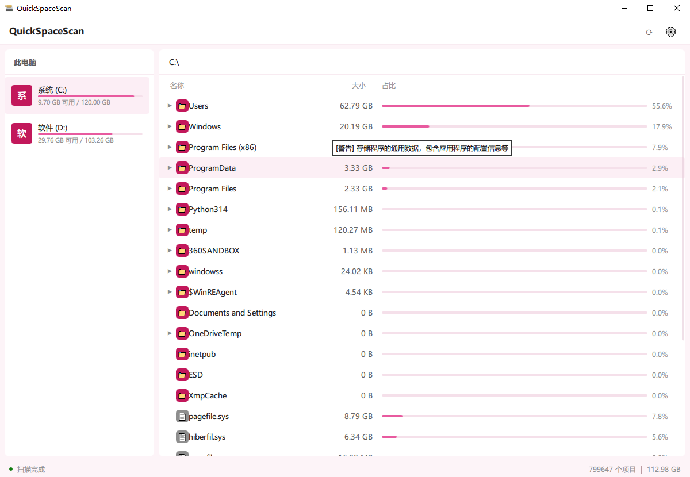
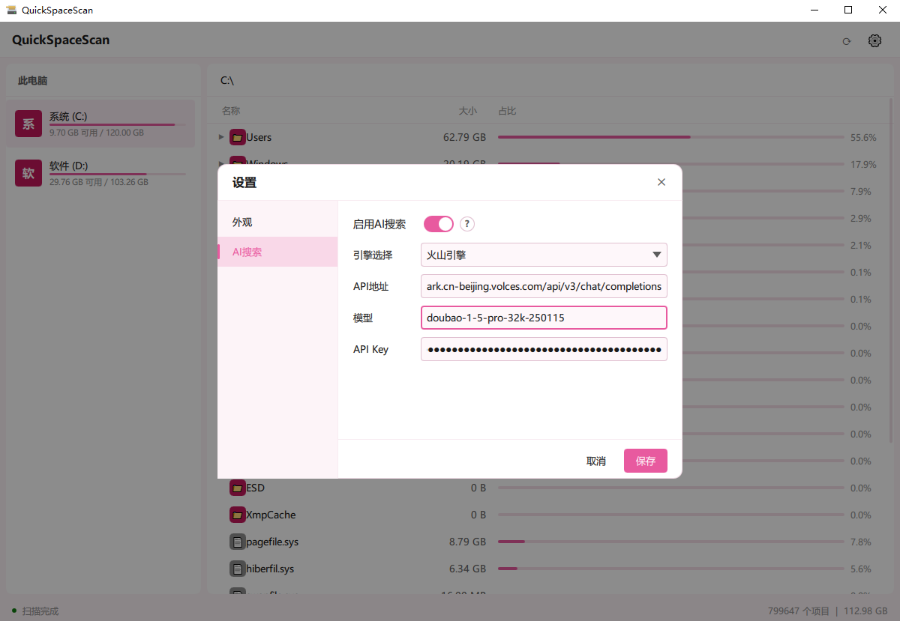
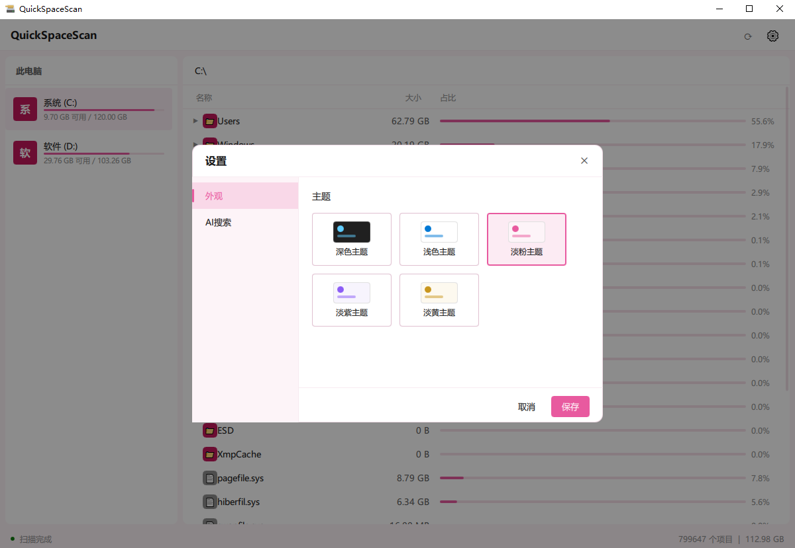

<div align="center">

# QuickSpaceScan

**Windows 磁盘空间快速分析工具** / A fast disk space analyzer for Windows

[](https://www.qt.io/)
[](https://isocpp.org/)
[](LICENSE)
[](https://www.microsoft.com/windows)


</div>

---

## 简介 / Introduction

QuickSpaceScan 是一款类似 TreeSize / WizTree 的 Windows 磁盘空间分析工具，使用 Qt6 / QML 构建。它能快速扫描磁盘或文件夹，实时显示每个目录占用的空间大小，帮助你快速定位大文件和空间占用大户。

内置 **AI 风险评估** 功能，在删除文件/文件夹前自动判断其对系统的影响等级，避免误删重要文件。UI 采用 Win11 Fluent Design 风格，支持深色/浅色/淡粉/淡紫/淡黄 5 种主题。

## 功能特性 / Features

- ⚡ **多线程极速扫描** — 使用 QThreadPool 并行扫描，UI 无卡顿，文件夹大小实时更新
- 🔍 **AI 智能风险评估** — 集成大语言模型 API，悬浮/删除时自动分析文件夹重要性（支持火山引擎/豆包等，可通过配置切换模型）
- 🛡️ **智能删除保护** — 删除前显示颜色分级警告（安全/注意/警告/危险），AI 或本地规则双重保障
- 🎨 **Win11 Fluent Design** — 圆角、现代化配色、流畅动画，5 种内置主题自由切换
- 💾 **路径缓存** — 同磁盘扫描结果自动缓存，目录导航无需重新扫描（仅主动刷新时重扫）
- 📊 **磁盘可视化** — 侧边栏显示所有驱动器，带已用空间进度条和容量信息
- 📁 **地址栏导航** — 可直接输入路径跳转，支持盘符缩写（如输入 `C` 自动跳转 `C:\`）
- 🔗 **系统集成** — 右键可在资源管理器中打开目标位置
- ⛔ **系统目录保护** — 自动跳过 `$Recycle.Bin`、`System Volume Information` 等系统保护目录

## 截图 / Screenshots

<!-- 在实际发布时替换为真实截图 -->
<p align="center">
  
  
  
</p>

## 构建 / Building

### 环境要求 / Requirements

- **Qt 6.5+**（推荐 6.8.x），模块：Qt Quick、Qt Quick Controls 2、Qt Network
- **CMake 3.16+**
- **MSVC 2022**（Visual Studio 2022 Build Tools，支持 C++17）
- Windows 10/11（x64）

### 编译步骤 / Build Steps

1. 克隆仓库：
   ```bash
   git clone https://github.com/yourname/QuickSpaceScan.git
   cd QuickSpaceScan
   ```

2. 使用 Qt Creator 打开 [CMakeLists.txt](CMakeLists.txt)，选择 MSVC 2022 64-bit Kit，点击构建。

   或使用命令行：
   ```powershell
   mkdir build && cd build
   cmake .. -G "NMake Makefiles" -DCMAKE_BUILD_TYPE=Release
   # 或使用 Qt Creator 自带的 jom/ninja
   cmake --build . --config Release
   ```

3. 部署（收集 Qt 依赖 DLL）：
   ```powershell
   windeployqt --release --compiler-runtime --qmldir .. --dir deploy appQuickSpaceScan.exe
   ```

## AI 功能配置 / AI Configuration

AI 风险评估功能通过 `ai_config.json` 配置，支持以下位置（按优先级）：

1. 程序同级目录（exe 旁边）
2. 程序目录下的 `resources/` 文件夹
3. Qt 资源内置文件

配置文件示例（[resources/ai_config.json](resources/ai_config.json)）：

```json
{
  "enabled": true,
  "apiUrl": "https://ark.cn-beijing.volces.com/api/v3/chat/completions",
  "apiKey": "your-api-key-here",
  "model": "ep-xxxxxxxxxxxxx",
  "timeoutMs": 8000,
  "systemPrompt": "你是一个Windows系统文件风险评估专家..."
}
```

- `apiUrl`：兼容 OpenAI 格式的 Chat Completions API 端点
- `apiKey`：你的 API 密钥
- `model`：模型/接入点 ID
- `enabled`：是否启用 AI 查询，可在设置界面开关

> 💡 AI 不可用时（无配置、网络错误、token 问题等），自动降级为本地 `system_paths.json` 规则查询，不影响正常使用。

## 项目结构 / Project Structure

```
QuickSpaceScan/
├── CMakeLists.txt
├── Main.qml                      # QML 入口
├── main.cpp                      # C++ 入口
├── resources/
│   ├── ai_config.json            # AI 配置（示例）
│   ├── system_paths.json         # 本地系统路径风险规则
│   └── icons/                    # 应用图标
├── src/
│   ├── core/                     # 核心模块
│   │   ├── scanengine.*          # 扫描引擎（多线程调度、树管理）
│   │   ├── treeitem.*            # 树形节点数据结构
│   │   ├── treemodel.*           # QML 列表数据模型
│   │   └── appsettings.*         # 应用设置持久化
│   ├── adapters/
│   │   └── drivemanager.*        # 磁盘驱动器枚举与列表模型
│   ├── ai/
│   │   └── airiskprovider.*      # AI 风险查询（HTTP 异步、缓存、解析）
│   └── risk/
│       └── pathriskprovider.*    # 风险查询门面（本地规则 + AI 统一接口）
└── ui/
    ├── views/
    │   ├── HomeView.qml          # 主视图
    │   └── Sidebar.qml           # 侧边栏（驱动器列表）
    ├── components/
    │   ├── TreeListView.qml      # 文件列表视图
    │   ├── TreeItemDelegate.qml  # 列表项代理
    │   ├── StatusBar.qml         # 底部状态栏
    │   ├── IconButton.qml        # 图标按钮控件
    │   └── SettingsDialog.qml    # 设置弹框
    └── themes/
        ├── ThemeManager.qml      # 主题管理器
        ├── LightTheme.qml        # 浅色主题
        └── DarkTheme.qml         # 深色主题
```

## 技术要点 / Technical Highlights

| 模块 | 说明 |
|------|------|
| 多线程扫描 | QThreadPool + QRunnable，目录级任务分发，切换路径立即停止旧扫描 |
| 算法 | 主要使用广度优先算法对磁盘进行扫描，避免扫描深度过大导致栈溢出问题 |
| 刷新节流 | 150ms 批量刷新 UI，高频文件信号不直接刷新界面 |
| 坐标映射 | TreeItem 均在主线程创建，跨线程使用 QueuedConnection |
| 路径规范化 | 统一小写+反斜杠作为 key，O(1) 哈希查找路径节点 |
| AI 异步 | QNetworkAccessManager 异步请求，结果缓存避免重复查询 |
| Fluent UI | QML 自绘控件，5 主题颜色系统，圆角/阴影/动画 |

## 使用说明 / Usage

1. **选择驱动器**：点击左侧驱动器列表选择磁盘开始扫描
2. **浏览目录**：双击文件夹进入子目录，点击左上角 `‹` 按钮返回上级
3. **路径跳转**：点击顶部路径栏输入路径，按回车直接跳转
4. **查看风险**：鼠标悬停在文件夹上，显示 AI/本地风险描述
5. **删除文件**：右键文件夹选择删除，查看风险等级警告后确认
6. **外部打开**：右键文件夹选择"在资源管理器中打开"
7. **切换主题/配置AI**：点击右上角 ⚙️ 设置按钮

## 已知限制 / Limitations

- 仅支持 Windows 平台（使用了 `ShellExecuteW`、Windows 磁盘 API）
- Junction points / 重解析点已做防递归处理，但仍建议避免扫描特殊目录
- 首次扫描大磁盘可能需要较长时间，后续切换目录使用缓存无需重扫

## 贡献 / Contributing

欢迎提交 Issue 和 Pull Request！

## 许可证 / License

[MIT License](LICENSE)

---

**如果这个工具对你有帮助，欢迎给个 ⭐ Star！**
本软件大部分是AI辅助编写，暂时只对部分关键代码进行优化，qml页面部分代码不建议学习。
